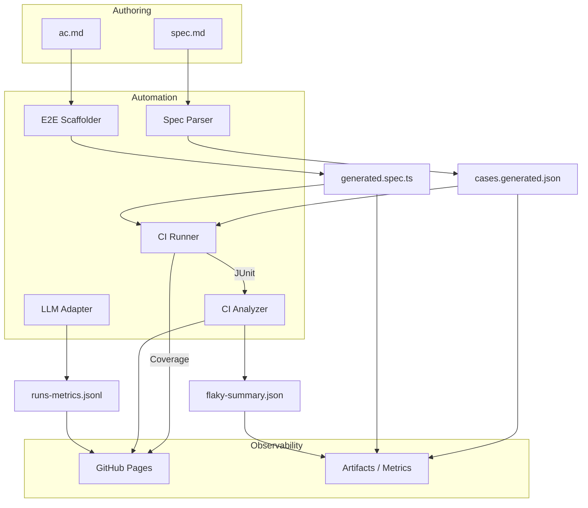

# 設計（全体アーキテクチャ）

## コンポーネント
- **Spec Parser**（#1）：仕様 Markdown → cases.json（スキーマ準拠）。  
- **E2E Scaffolder**（#2）：AC → Playwright 雛形（HITL 前提）。  
- **CI Analyzer**（#3）：JUnit 履歴 → flaky 指標、再実行ポリシー。  
- **LLM Adapter**（#4）：直列/並列 + 影実行、異常系イベント、フォールバック。

## データフロー（言語化）
1. 仕様（spec.md, ac.md）→ 変換（#1/#2）→ 成果物（cases.json / generated.spec.ts）
2. 実行 → JUnit ログ → 解析（#3）→ flaky レポート
3. LLM 経路は**影実行**で継続計測（#4）→ metrics JSONL → Pages 表示

## アーキテクチャ図

## コンポーネントの責務と境界
- **Spec Parser**：Markdown の構造化、JSON スキーマ出力、Lint 結果の提供。
- **E2E Scaffolder**：Playwright テストの下書き生成、TODO 注釈付与、レビュー補助。
- **CI Runner**：テスト実行と成果物収集。GitHub Actions での並列実行を想定。
- **CI Analyzer**：JUnit ログの履歴管理と flaky スコアリング、再実行ポリシー出力。
- **LLM Adapter**：本番レスポンスと影実行の比較、フォールバック制御、メトリクス記録。
- **Observability**：Pages/Artifacts で成果物を閲覧・ダウンロード可能にする。

## 配置（ローカル/CI）
- ローカル：Dev Container + `just` で統一手順（setup/test/lint/report）。
- CI：GitHub Actions（Linux）。成果物は Artifacts と Pages に公開。

### キャッシュ / ストレージ
- `actions/cache` を用いて npm / pip 依存関係を再利用し、CI 時間を短縮。
- Spec Parser の結果 JSON は Git LFS を想定せず、サイズを抑制。差分レビューを重視。
- flaky レポートや metrics JSONL は GitHub Pages / Artifacts で保持し、履歴比較は外部ストレージ（S3 等）に連携可能とする。

## 可観測性
- JUnit、Coverage、LLM metrics（JSONL）を Pages で可視化。
- 主要メトリクス：**flaky 率、平均レイテンシ、成功率、フォールバック発火率、カバレッジ**。

## セキュリティ/権限
- Actions 最小権限（`contents:read` / `pages:id-token,write`）。  
- シークレットは `ACTIONS_RUNTIME_TOKEN` 経路を使わない（外部送信なしの設計）。
