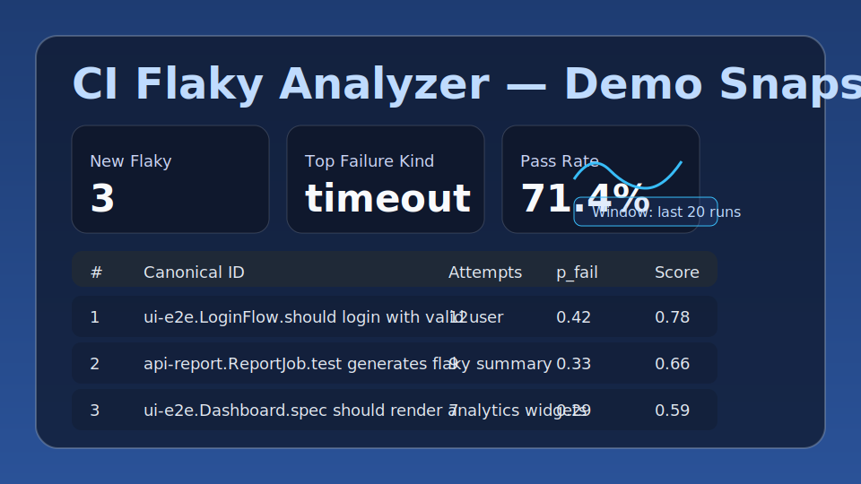

# CI Flaky Analyzer — 生成物ガイド

CI 解析コマンドで作成される HTML / CSV / Markdown はコミット対象外です。以下の手順でいつでも再生成できます。

## 生成手順
1. 解析対象の JUnit XML を `projects/03-ci-flaky/junit/` に配置するか、`just test` を実行してデモデータを用意します。
2. 集計とレポートを生成:
   ```bash
   npm run ci:analyze
   ```
3. （任意）Issue テンプレートを作成:
   ```bash
   npm run ci:issue
   ```
4. `projects/03-ci-flaky/out/` 配下に `summary.json|csv`、`flaky_rank.json|csv`、`index.html`、`issues/*.md` が生成されます。

> **Note:** `out/` 以下は `.gitignore` に登録済みのためコミットされません。必要に応じて `just test` を実行して最新状態を確認してください。

## 最新スクショ
生成した HTML レポートの構成イメージです。詳細なスクショは `just test` → `projects/03-ci-flaky/out/index.html` をブラウザで開いて確認してください。


