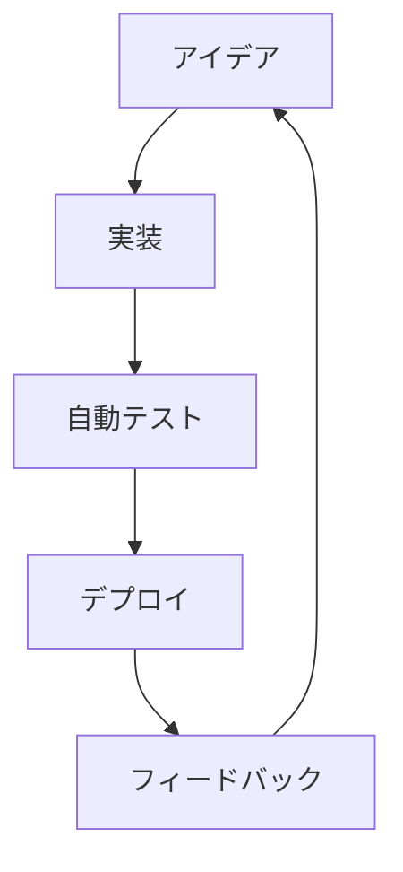

# プロジェクト概要ドキュメント

このドキュメントは、ポートフォリオの価値を常設的に共有するためのハブです。GitHub Pages で公開し、週次サマリやHTMLレポートへの導線を集約します。

## ナビゲーション

- [最新の週次サマリ](../reports/weekly-summary.md) ※必要に応じて更新してください。
- [HTMLレポート](../reports/index.html) ※生成された成果物をここに配置できます。
- [リポジトリトップ](../README.md)

## 可視化

## 公開手順メモ

1. ドキュメントを更新したら `main` ブランチへマージします。
2. Publish Docs ワークフローが自動で実行され、GitHub Pages に最新の内容が公開されます。
3. 公開URLは GitHub リポジトリの「About→Website」に設定しておくと便利です。
