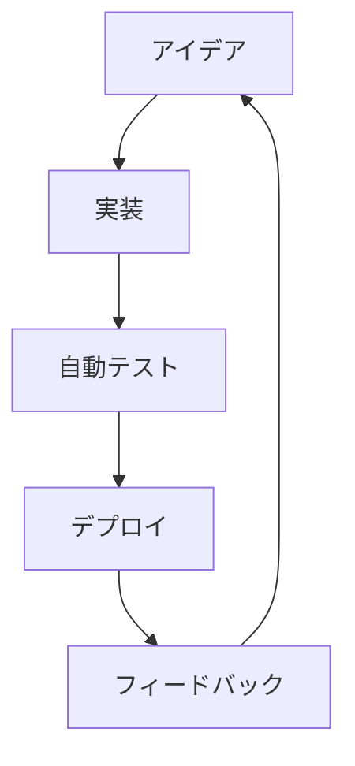

# プロジェクト概要ドキュメント

このドキュメントは、ポートフォリオの価値を常設的に共有するためのハブです。GitHub Pages で公開し、週次サマリや HTML レポートへの導線を集約します。設計から運用までのストーリーを一貫して追えるよう、概要→仕様→設計→運用の順に整理しています。

## 目次（Table of Contents）

- [概要（Overview）](overview.md)
- 仕様
  - [#1 仕様 → 構造化テスト（決定的生成）](specs/01-spec2cases.md)
  - [#2 AC → E2E 雛形生成（HITL 支援）](specs/02-ac-to-e2e.md)
  - [#3 CI ログ解析 → フレーク検知](specs/03-ci-flaky.md)
  - [#4 LLM Adapter（影実行・フォールバック）](specs/04-llm-adapter-shadow.md)
- 設計
  - [全体アーキテクチャ](design/architecture.md)
  - [データ契約](design/data-contracts.md)
  - [CI/CD 設計](design/ci-cd.md)
  - [リスク・運用](design/risks-and-ops.md)
- 追加資料
  - [最新の週次サマリ](../reports/weekly-summary.md) ※必要に応じて更新してください。
  - [HTML レポート](../reports/index.html) ※生成された成果物をここに配置できます。
  - [リポジトリトップ](../README.md)

## ハイライト
- **仕様 → テスト → CI → レポート** の最小パイプラインを段階的に実装するためのドキュメントセット。
- 各仕様はデータ契約と AC を明記し、ツール実装時のブレを抑制。
- CI/CD と運用ガイドで、Pages 公開やメトリクス分析までを一本化。

## 可視化

## ドキュメント活用方法
1. まず [概要](overview.md) で狙いと成果物の一覧を把握します。
2. 次に [specs/](specs/01-spec2cases.md) で各ユースケースの要件と AC を確認します。
3. [design/](design/architecture.md) ではシステム構成・データ契約・CI の詳細を参照し、実装の指針とします。
4. 運用フェーズでは [リスク・運用](design/risks-and-ops.md) を読み、KPI やインシデント対応フローを準備します。

## 公開手順メモ

1. ドキュメントを更新したら `main` ブランチへマージします。
2. Publish Docs ワークフローが自動で実行され、GitHub Pages に最新の内容が公開されます。
3. 公開 URL は GitHub リポジトリの「About→Website」に設定しておくと便利です。
