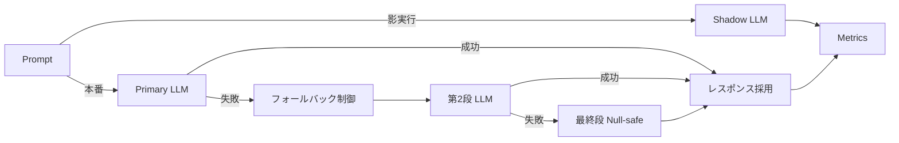

# 仕様 #4：LLM Adapter（影実行・フォールバック）

## 目的と価値
本番系の出力を採用しつつ、**並走する “影実行（shadow）”** で差分を継続計測。  
Timeout / RateLimit / Invalid JSON など**異常系注入**と**フォールバック**設計を検証する。

## 入力・出力（契約）
- 入力：プロンプト、パラメータ（温度、max_tokens、リトライ方針）。  
- 出力：`runs-metrics.jsonl`（時刻、モデル名、レイテンシ、トークン数、成功/失敗、フォールバック回数、コスト見積）  
  ※ JSONL は Pages で可視化する前提。

## 受け入れ条件（AC）
- 影実行は**本番経路に影響を与えない**（非同期/隔離）。  
- エラーごとに**可観測なイベント**（timeout/rate_limit/parse_error 等）を付与。  
- フォールバックは **最大 N 段**、指数バックオフ、**最終的に Null-safe な失敗**でクローズ。

## 非機能要件
- ローカル実行 1 ランで 1,000 回試行のメトリクス収集に耐える（ダンプのみ）。
- 設定は `.env` / CLI フラグで再現可能（ベンダ非依存の抽象名）。

## 実行フロー（並列 + 影実行）

## フォールバックポリシー例
- 最大 3 段構成：Primary → Alternative Model → Template-based Null Response。
- 各段で指数バックオフ（例：1s, 2s, 4s）を適用し、`retry_after` をメトリクスに記録。
- `error_type` ごとにフォールバックの制御可否を判定。
  - `timeout`：バックオフ後に再試行。
  - `rate_limit`：`Retry-After` を尊重し、待機後に再試行。
  - `parse`：別モデルまたはルールベース parser に切り替え。
- 最終段は「安全なデフォルト応答」を返し、呼び出し元に失敗を通知（Null-safe）。

## メトリクス収集の観点
- `latency_ms`：本番経路と影実行の双方で計測し、差異を比較。
- `fallbacks`：発火段数と成功段数を分離集計し、コスト計算に反映。
- `shadow_delta`：本番出力と影実行出力の差分サイズ（Cosine / Edit distance）。
- `cost_estimate`：ベンダごとの単価テーブルを抽象化し、JSONL に単価内訳を追加。
- `trace_id`：各リクエストに UUID を付与し、A/B 分析や障害調査を容易にする。
